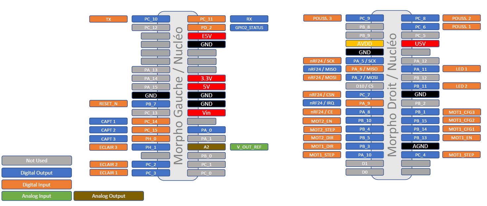

Machine Vision Electronic Control board
=======================================

This platform is associated to an **electronic board** for controlling : the translation of the conveyor, the activation of each sorting system, the activation of the lighting system.

.. note::
	This board can be used to control 2 different step-motors.

Microcontroller
---------------

Pinouts
~~~~~~~

   
   Pinouts of the board

Power stage and step motor driver
---------------------------------

Two step-motors (type xxx - xV power supply) can be controlled independently  by two **TMC2100** (`Kit TMC Silent Step Stick <https://fr.farnell.com/trinamic/tmc-silentstepstick/carte-driver-moteur-pas-a-pas/dp/2822153>`_) drivers.

The first driver (**Motor 1**) can be configured by CFG1, CFG2 and CFG3 pins (see `TMC2100 Documentation <https://www.utmel.com/productdetail/trinamicmotioncontrolgmbh-tmc2100tat-5369295?utm_source=bing&utm_medium=cpc&utm_campaign=Utmel-octop-T~Z-ic-3.28(2229)&utm_term=TMC2100-TA-T&utm_content=T~Z-Integrated+Circuits-3.28>`_).
The second driver (**Motor 2**) is already set up as CFG3=open (*External reference voltage on pin AIN*), CFG2/1=0b01 (*HalfSteps*).

.. list-table:: TMC2100 Pins / Motor 1
   :widths: 34 33 33
   :header-rows: 1

   * - TMC2100
     - Elec Board
     - Nucleo Board
   * - EN (In)
     - MOT1_EN (Out)
     - PB_13
   * - DIR (In)
     - MOT1_DIR (Out)
     - PB_3
   * - STEP (In)
     - MOT1_STEP (Out)
     - PA_10
   * - CFG1 (In)
     - MOT1_CFG1 (Out)
     - PB_14
   * - CFG2 (In)
     - MOT1_CFG2 (Out)
     - PB_15
   * - CFG3 (In)
     - MOT1_CFG3 (Out)
     - PB_1
   * - VREF_AIN (Analog In)
     - V_OUT_REG (Analog Out)
     - PA_4 / A2

To configure CFG3 as open pin, the J2 jumper must be removed (*External reference voltage on pin AIN*). To connect the CFG3 input pin of the TMC2100 driver to the Nucleo Board (MOT1_CFG3 pin), the J2 jumper must be in place.

.. list-table:: TMC2100 Pins / Motor 2
   :widths: 34 33 33
   :header-rows: 1

   * - TMC2100
     - Elec Board
     - Nucleo Board
   * - EN (In)
     - MOT2_EN (Out)
     - PB_10
   * - DIR (In)
     - MOT2_DIR (Out)
     - PB_5
   * - STEP (In)
     - MOT2_STEP (Out)
     - PB_4
   * - VREF_AIN (Analog In)
     - V_OUT_REG (Analog Out)
     - PA_4 / A2

An external power supply must be connected to the J5 connector (VMOT). This nominal supply for the xxx step-motor is 4V, for a maximal current of 1A per phase.

More details on the `TMC2100 Documentation <https://www.utmel.com/productdetail/trinamicmotioncontrolgmbh-tmc2100tat-5369295?utm_source=bing&utm_medium=cpc&utm_campaign=Utmel-octop-T~Z-ic-3.28(2229)&utm_term=TMC2100-TA-T&utm_content=T~Z-Integrated+Circuits-3.28>`_.

Presence sensors
----------------

Three digital inputs are dedicated to **SEN0239** infrared presence detectors, including supply of the sensors.

.. list-table:: Presence Sensors Pins
   :widths: 34 33 33
   :header-rows: 1

   * - Sensor
     - Elec Board
     - Nucleo Board
   * - Sensor 1
     - CAPT1 (In)
     - PC_14
   * - Sensor 2
     - CAPT2 (In)
     - PC_15
   * - Sensor 3
     - CAPT3 (In)
     - PH_0

Communication
-------------

A **RN41/42 XV** module or a **nrF24L01** module could be implemented for radio-frequency communication. 

BlueTooth communication via RN41/42 module
~~~~~~~~~~~~~~~~~~~~~~~~~~~~~~~~~~~~~~~~~~

RF communication via nRF24L01 module
~~~~~~~~~~~~~~~~~~~~~~~~~~~~~~~~~~~~

.. list-table:: nRF24L01 Pins
   :widths: 34 33 33
   :header-rows: 1

   * - nRF24L01
     - Elec Board
     - Nucleo Board
   * - SCK / In
     - nRF24 / SCK (Out)
     - PA_5 / D13 *
   * - MISO / Out
     - nRF24 / MISO (In)
     - PA_6 / D12
   * - MOSI / In
     - nRF24 / MOSI (Out)
     - PA_7 / D11
   * - CSN / In
     - nrF24 / CSN (Out)
     - PC_7
   * - IRQ / Out
     - nrF24 / IRQ (In)
     - PA_9
   * - CE / In
     - nrF24 / CE (Out)
     - PA_8

* LED1 (LD2 on board led) could not be used if nrF24 is connected

Lighting system
---------------

The lighting system is an EFFI-Ring from the Effilux company, type RGB (ref ??). Red, Blue and Green lights can be controlled independently.

IMAGE OF THE LIGHT

A M12-5pins connector is used to control and power the ring. The power supply is 24V. The pins controlling the 3 independent sources are connected to a MOSFET transistor.

.. list-table:: Light Control Pins
   :widths: 34 33 33
   :header-rows: 1

   * - Light Source
     - Elec Board
     - Nucleo Board
   * - Red
     - ECLAIR 1
     - PC_3
   * - Green
     - ECLAIR 2
     - PC_2
   * - Blue
     - ECLAIR 3
     - PH_1

An external power supply must be connected to the J19 connector (V_ECLAIRAGE). The nominal supply for the EFFi-Ring source is 24V.

More details on the `EFFI-Ring Documentation <https://www.effilux.com/fr/produits/annulaire/effi-ring>`_.

